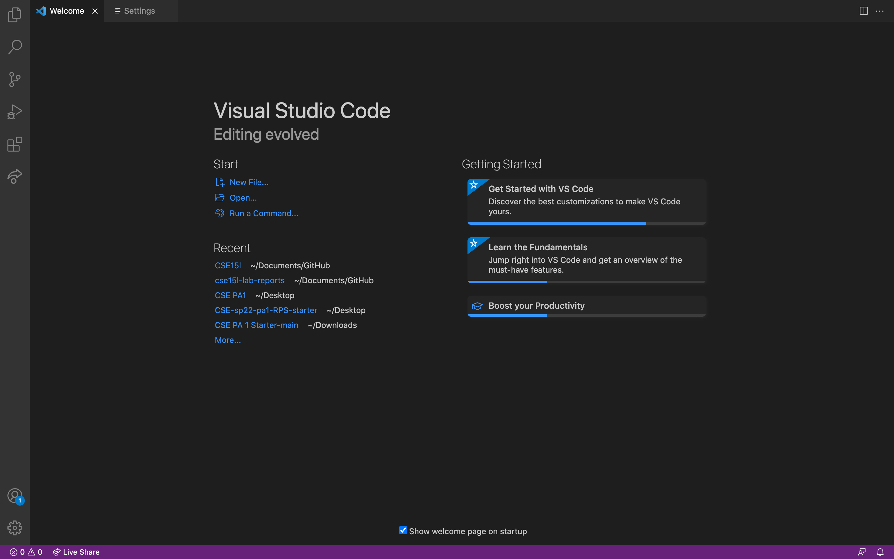
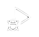
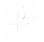

# Lab Report 1

The Secure Shell Protocal, also known as SSH, allows two computers to securely communicate over an unsecured network. This blog post is a documentation of the steps required to set up and use remote access. 

## Installing VS Code   

We will be using [VS Code](https://code.visualstudio.com/) as our main IDE for this course. 

**Please follow these steps to set up VS Code**
- Head over to [VS Code Install Page](https://code.visualstudio.com/)
- Press the `Download` Button
- Select `Window`, `Linx`, or `MacOS`
- Finish the download process and open VS Code

When the procedure is done, your IDE should look something similar to the image below.

The following table provides a brief description of the icons on the side menu.

| Icon             | Name             | Functionality                                     |
| ---------------- | ---------------- | ------------------------------------------------- |
| | Explorer         | Place to view the files in your working directory |
|  | Search | You may enter a `keyword` and VS Code will find the files containing that string.
| | Source Control | The class that handles the changes made to the directory.
|  | Run and Debug | This function allows you to debug the errors in your code.
|  | Extensions | You may install extension packages here. They are extra tools that may be useful for certain projects.
## Remotely Connecting

## Trying Some Commands

## Moving Files with scp

## Setting an SSH Key

## Optimizing Remote Running