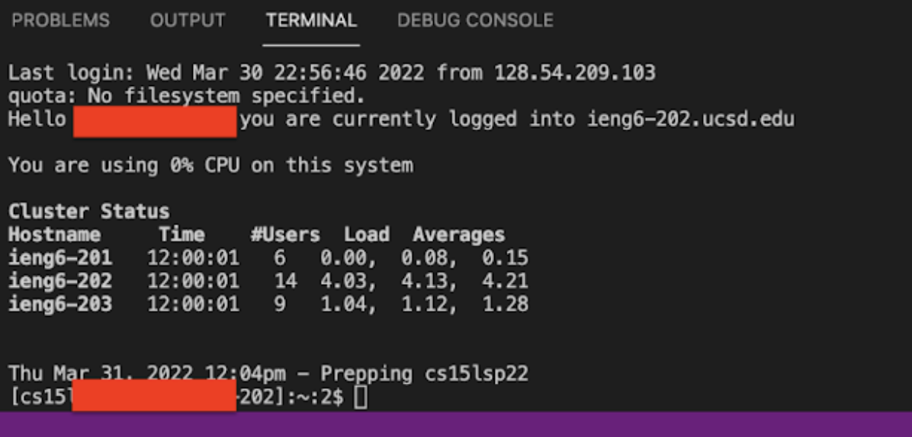

# Lab Report 1

The Secure Shell Protocal, also known as SSH, allows two computers to securely communicate over an unsecured network. This blog post is a documentation of the steps required to set up and use remote access. 

## Installing VS Code   

We will be using [VS Code](https://code.visualstudio.com/) as our main IDE for this course. 

**Please follow these steps to set up VS Code**
- Head over to [VS Code Install Page](https://code.visualstudio.com/)
- Press the `Download` Button
- Select `Window`, `Linx`, or `MacOS`
- Finish the download process and open VS Code

When the procedure is done, your IDE should look something similar to the image below.


The following table provides a brief description of the icons on the side menu.

| Icon             | Name             | Functionality |
| :--------- | ----------- | ------------ |
| | Explorer|Place to view the files in your working directory|
|  | Search | You may enter a `keyword` and VS Code will find the files containing that string.|
| | Source Control | The class that handles the changes made to the directory.|
|  | Run and Debug | This function allows you to debug the errors in your code.|
|  | Extensions | You may install extension packages here. They are extra tools that may be useful for certain projects.|

____
________
## Remotely Connecting

> MacOS and Linux terminals have SSH built in. If you are using Windows, please [install SSH](https://docs.microsoft.com/en-us/windows-server/administration/openssh/openssh_install_firstuse).

#### Look up your account name
- Head over to [Change Password](https://sdacs.ucsd.edu/~icc/index.php) page
  - For the `Username`, type your UCSD username
  - For the `Student ID`, type your ID starting with A
- After hitting `submit`, click on `change your password`
- Next, type in your old password, new password, and confirm password.
- Select `no` for change TritonLink password 
- Select `yes` to change course-specific account password
- Click back on `confirm password` and hit enter
- _**Do NOT click on `Check Password`**_

Go back to VS Code and open a terminal (Control + `)
Type the following command in your terminal

```
ssh cs15lsp22[YOUR ACCOUNT]@ieng6.ucsd.edu
```

When connecting for the first time, you may get a message similar to that below.

```
The authenticity of host 'ieng6.ucsd.edu (128.54.70.227)' can't
be established.
RSA key fingerprint is
SHA256:ksruYwhnYH+sySHnHAtLUHngrPEyZTDl/1x99wUQcec.
Are you sure you want to continue connecting
(yes/no/[fingerprint])?
```

Type `yes` in your terminal and enter your password.
> The password will not be visible on terminal; however, it is still logged as each character is typed in.

When this process is done, your screen should look similar similar to that below.



You are now connected to a CSE lab computer. We will now explore some comands.
________

## Trying Some Commands
________

## Moving Files with scp
________

## Setting an SSH Key
________

## Optimizing Remote Running