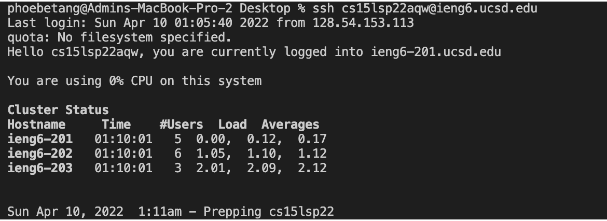

# Lab Report 1

The Secure Shell Protocal, also known as SSH, allows two computers to securely communicate over an unsecured network. This blog post is a documentation of the steps required to set up and use remote access. 

## Installing VS Code   

We will be using [VS Code](https://code.visualstudio.com/) as our main IDE for this course. 

**Please follow these steps to set up VS Code**
- Head over to [VS Code Install Page](https://code.visualstudio.com/)
- Press the `Download` Button
- Select `Window`, `Linx`, or `MacOS`
- Finish the download process and open VS Code

When the procedure is done, your IDE should look something similar to the image below.


The following table provides a brief description of the icons on the side menu.

| Icon             | Name             | Functionality |
| :--------- | ----------- | ------------ |
| | Explorer|Place to view the files in your working directory|
|  | Search | You may enter a `keyword` and VS Code will find the files containing that string.|
| | Source Control | The class that handles the changes made to the directory.|
|  | Run and Debug | This function allows you to debug the errors in your code.|
|  | Extensions | You may install extension packages here. They are extra tools that may be useful for certain projects.|

________
## Remotely Connecting

> MacOS and Linux terminals have SSH built in. If you are using Windows, please [install SSH](https://docs.microsoft.com/en-us/windows-server/administration/openssh/openssh_install_firstuse).

#### Look up your account name
- Head over to [Change Password](https://sdacs.ucsd.edu/~icc/index.php) page
  - For the `Username`, type your UCSD username
  - For the `Student ID`, type your ID starting with A
- After hitting `submit`, click on `change your password`
- Next, type in your old password, new password, and confirm password.
- Select `no` for change TritonLink password 
- Select `yes` to change course-specific account password
- Click back on `confirm password` and hit enter
- _**Do NOT click on `Check Password`**_

Go back to VS Code and open a terminal (Control + `)
Type the following command in your terminal

```
ssh cs15lsp22[YOUR ACCOUNT]@ieng6.ucsd.edu
```

When connecting for the first time, you may get a message similar to that below.

```
The authenticity of host 'ieng6.ucsd.edu (128.54.70.227)' can't
be established.
RSA key fingerprint is
SHA256:ksruYwhnYH+sySHnHAtLUHngrPEyZTDl/1x99wUQcec.
Are you sure you want to continue connecting
(yes/no/[fingerprint])?
```

Type `yes` in your terminal and enter your password.

> The password will not be visible on terminal; however, it is still logged as each character is typed in.

When this process is done, your screen should look similar to that below.



You are now connected to a CSE lab computer. We will now explore some comands.
________

## Trying Some Commands

The following table includes the basic commands

|Name |Functionality |Arg|
| --- | --- | ---|
| pwd | prints the path for the working directory | none |
| ls | list the file in working directory | none |
| ls -a| list all the files and hidden files in working directory | none |
| cp | copy a file | \<source>\<destination>|
|mkdir| makes a directory | name of the directory |
|rm | removes a file | name of file |
| cat | look at, create, or edit a file | \> and filename |
|touch | create a file | filename |
|Ctrl C or D | exit out of remote server| None |
----

I ran a few commands below. The narration can be found under the screenshot.


- I changed directory back to admin
- I changed directory to `Desktop` and then a pre-existing directory called `Projects`
- I made a directory named `commands_test`
- I made a file named `test1.txt`
- I edited `test1.txt` with the following texts
  - hello
  - my name is phoebe
  - i like food
- I exited out of editing
- I typed `cat test1.txt` again to look at the file
- I typed ls to list the files in `commands_test`

________

## Moving Files with scp

> We will use the file given by Lab 1 to better demonstrate scp

```java
class WhereAmI {
public static void main(String[] args) {
System.out.println(System.getProperty("os.name"));
System.out.println(System.getProperty("user.name"));
System.out.println(System.getProperty("user.home"));
System.out.println(System.getProperty("user.dir"));
}
}
```

The follow image builds the writes, builds, and executes the `WhereAmI.java` file. As we can see, the information is fetched from the client.


Next, I will copy the file to the server with the command.
```
scp WhereAmI.java cs15lsp22[YOUR USER]@ieng6.ucsd.edu:~/
```
Finally, I will take the following steps to run the program from server.

- Log in to SSH
- Enter my password
- Use the `javac` command to build `WhereAmI.java`
- Use the `java` command to run the `WhereAmI` class
- The program then fetches information from the server


*note: it did not prompt me to enter password because I already have a key set up (cover next section). The `WhereAmI.class` is already there because I built it before*<br>

________

## Setting an SSH Key

It is a tedious process to have to type in your password every time you run `ssh` or `scp`. We can speed up this process by generating `ssh keys`, which allows SSH to use a pair of files for your password.

In order to set up `SSH Key`, please follow these steps.

#### type the following command on your client's terminal

```
$ ssh-keygen
```
- type in the file path provided in parathesis
  - *my file already exists from before, which prompted the question if I want to overwrite it*
- press `enter` for no passphrase
- press `enter` again


After those steps, your terminal should look similar to the image below.


After, log in to the server and execute the following commands.

```
$ ssh cs15lsp22[YOUR USER]@ieng6.ucsd.edu
$ mkdir.ssh
$ exit
```
Now you should be back on the client computer. Copy your key over with the following command

```
scp /Users/[YOUR USERNAME]/.ssh/id_rsa.pub
cs15lsp22[YOUR USER]@ieng6.ucsd.edu:~/.ssh/authorized_keys
```


Once this process is done, you should be able to execute `ssh` and `scp` without a password.<br>

________

## Optimizing Remote Running

There are a few ways to optimize the process of executing commands. The following shortcuts are very useful

- You may use the `tab` key to auto-complete your command.
- The `up` arrow allows you to view the previously executed commands.
