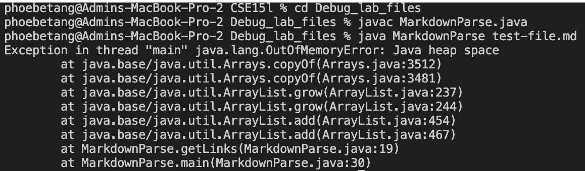
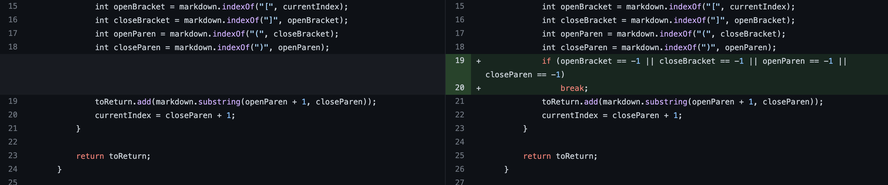
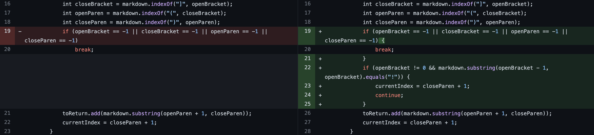
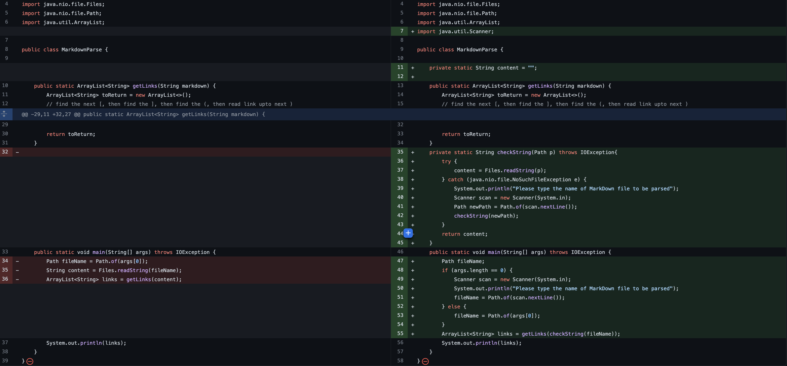
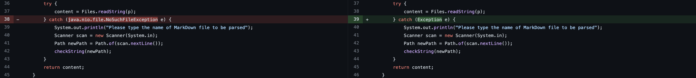

# Lab Report 2

[Home](https://adironene.github.io/CSE15l/index.html) 

When writing programs, it is common to encounter bugs. In fact, most projects require an average debug time of 50% - 75%. This report demonstrates some of the bugs found in the Markdown-parser and the steps our team took to fix the issues.

### Debugging Terminology

| Name                       | Functionality                                                                                       |
| -------------------------- | --------------------------------------------------------------------------------------------------- |
| **Symptom**                | A faulty program behavior that you can see                                                          |
| **Bug**                    | A flaw in a computer system that may have zero or more symptoms                                     |
| **Latent Bug**             | An asymptomatic bug; it will show itself at an inconvenient time                                    |
| **Debugging**              | using symptoms and other information to find a bug                                                  |
| **Failure-inducing input** | input to the program that causes the bug to execute and symptoms to appear                          |
| **Deterministic platform** | A platform having the property that it can reliably reproduce a bug from its failure-inducing input |

________

**Cite** : [Source](https://canvas.ucsd.edu/courses/37650/files/6915277?module_item_id=1359831) from Week 3 Lecture 6.
<br/><br/>

> **Note** - I created a new file to demonstrate the changes for cleaner code. The old version had a few random print statements inserted in multiple places. If interested, the original Repo can be found [Here](https://github.com/adironene/markdown-parser).

________
<br/><br/>

## Bug and Fix 1

This first bug that our team encountered was the `java.lang.OutOfMemoryError` error. 

#### Symptom of the failure-inducing input



#### Test file for a failure-inducing input

The test file that we used can be found [here](https://github.com/adironene/CSE15l/blob/main/Debug_lab_files/test-file.md). I have also included the file's content below

```
# Title

[link1](https://something.com)
[link2](some-thing.html)

```

#### Code change



#### Summary

Our group found that the code was entering an infinite loop under the `while (currentIndex < markdown.length())` condition. There was an extra space in the Markdown file so when the loop tried to search for a `closeParen` again, it may return `-1`. The line `currentIndex = closeParen + 1` made the currentIndex be -1 + 1 = 0, which resets it to the beginning of the string. I added an `if condition` to check if any of the elements we are searching for is not found, or -1, and break out of the loop if so.

________
<br/><br/>

## Bug and Fix 2

The second bug that our group found was that the code was also giving us links of images, which are supposed to be excluded.

#### Symptom of the failure-inducing input

```
phoebetang@Admins-MacBook-Pro-2 Debug_lab_files % java MarkdownParse imageFile.md 
[https://something.com]
```
#### Test file for a failure-inducing input

The test file that we used can be found [here](https://github.com/adironene/CSE15l/blob/main/Debug_lab_files/imageFile.md). I have also included the file's content below

```

```
#### Code change



#### Summary

The MarkDown parser was supposed to ignore image links. I added another `if condition` to check if there is a `!` in front of the `openBracket`. If so, update the `currentIndex` and `continue`, which skips the rest of the loop. I also checked to see if the `openBracket` is at index 0 so `openBracket - 1` does not cause an `StringIndexOutOfBoundsException`.

________
<br/><br/>

## Bug and Fix 3

The last bug that we found was that if we don't input a file as args or if the path doesn't work, the program just throws an exception and crashes.

#### Symptom of the failure-inducing input

- This is the error message for calling MarkdownParse without an arg
```
phoebetang@Admins-MacBook-Pro-2 Debug_lab_files % java MarkdownParse             
Exception in thread "main" java.lang.ArrayIndexOutOfBoundsException: Index 0 out of bounds for length 0
        at MarkdownParse.main(MarkdownParse.java:29)
```
-  This is the error message for calling MarkdownParse with an invalid arg
```
phoebetang@Admins-MacBook-Pro-2 Debug_lab_files % java MarkdownParse dj
Exception in thread "main" java.nio.file.NoSuchFileException: dj
        at java.base/sun.nio.fs.UnixException.translateToIOException(UnixException.java:92)
        at java.base/sun.nio.fs.UnixException.rethrowAsIOException(UnixException.java:106)
        at java.base/sun.nio.fs.UnixException.rethrowAsIOException(UnixException.java:111)
        at java.base/sun.nio.fs.UnixFileSystemProvider.newByteChannel(UnixFileSystemProvider.java:218)
        at java.base/java.nio.file.Files.newByteChannel(Files.java:380)
        at java.base/java.nio.file.Files.newByteChannel(Files.java:432)
        at java.base/java.nio.file.Files.readAllBytes(Files.java:3289)
        at java.base/java.nio.file.Files.readString(Files.java:3367)
        at java.base/java.nio.file.Files.readString(Files.java:3326)
        at MarkdownParse.main(MarkdownParse.java:43)
```

#### Test file for a failure-inducing input

We did not use a file for this bug since we are trying to handle the `ArrayIndexOutOfBoundsException` with no file input and the `java.nio.file.NoSuchFileException` with an invalid test file input.

```
java MarkdownParse             
java MarkdownParse fakefile

```
#### Code change




#### Summary

To handle the `ArrayIndexOutOfBoundsException` and the `java.nio.file.NoSuchFileException`, I checked if the args' length is 0. I imported a `scanner` to ask the user to retype the file input if it is invalid. In order to do so, I created a separate `checkString`  method and implemented a recursive call to the method until the input is valid. There were two changes for this bug. At first, I only did catch for `java.nio.file.NoSuchFileException`. However, I realized that if the user typed enter again, the mistake would not be caught. So I changed it to catch `exception e` to allow other exceptions. 

________