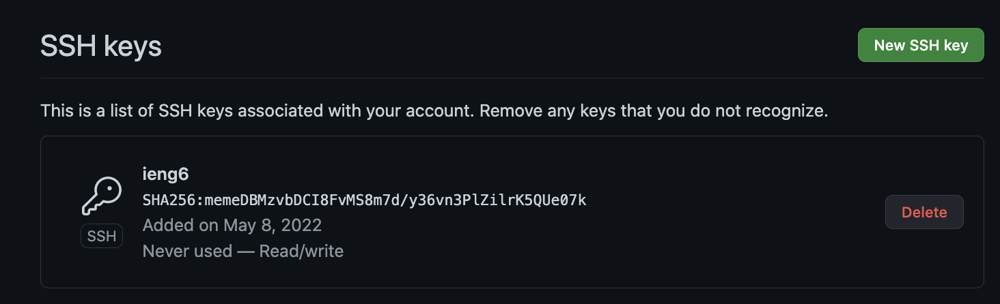
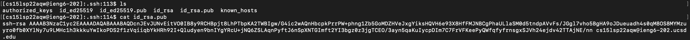
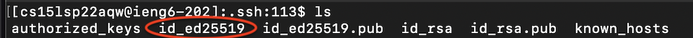
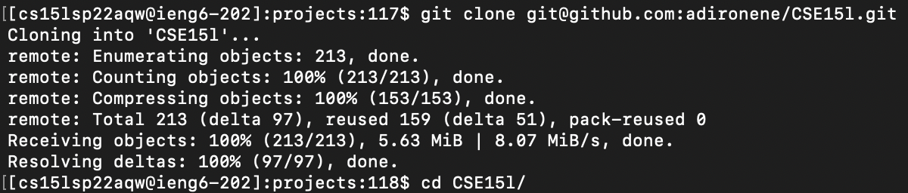
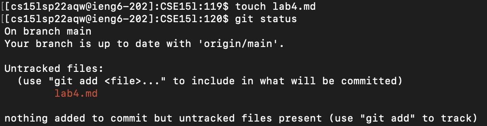
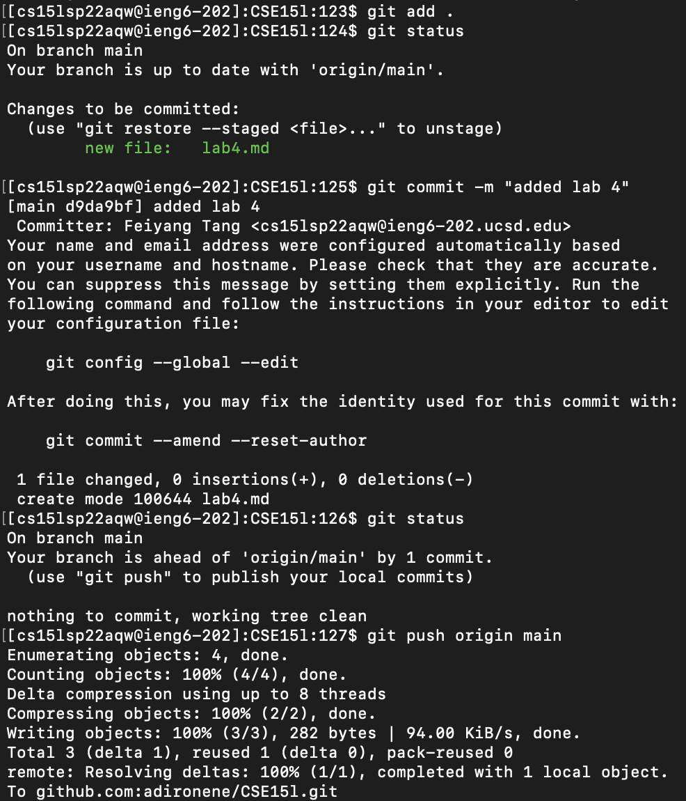
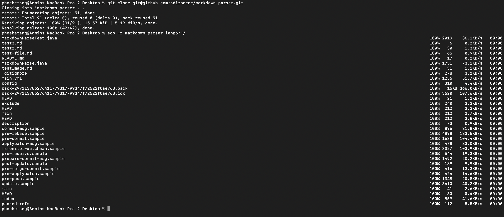
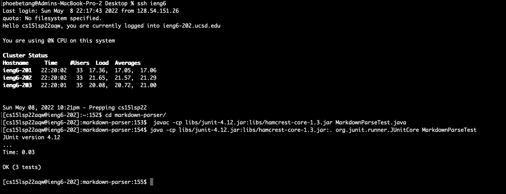
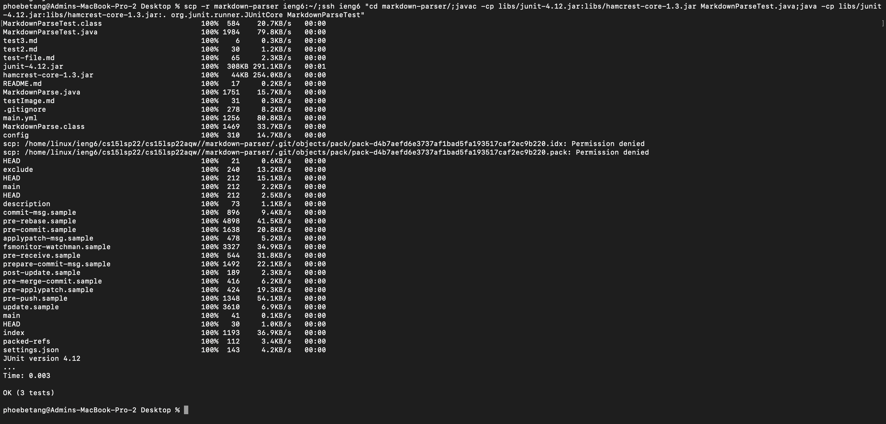

# Lab Report 3

[Home](https://adironene.github.io/CSE15l/index.html) 

In this lab report, I will discuss a few skills introduced to facilitate working with SSH and Github Repos. 
- **SSH Configuration** - Set up a shortcut to refrain from typing out the entire server name. If set up correctly, I only need to type `ssh ieng6` instead of `ssh cs15lsp22[user name]@ieng6.ucsd.edu`.
- **Github Access** - Set up a SSH Key to Github. When the key is set up correctly, you should be able to `clone` from private repository and `push`.
- **Copying Directories**

<br/><br/>

## SSH Configuration

It is tedious to type out `ssh cs15lsp22[user name]@ieng6.ucsd.edu` each time I try to log on to a server. To address this problem, we can edit the SSH Config file to add a nickname for the server. This way, SSH knows which server to log on to when you type the nickname.

#### Show your .ssh/config file

To set up, take the following steps:
- Create or edit the `~/.ssh/config` file
- add the following lines in the file

```
Host ieng6
HostName ieng6.ucsd.edu
User cs15lsp22zzz (use your username)
```

- You may use the command `cat > ~/.ssh/config ` and paste in the lines above

When you are finished with the steps above, your config file should look like this:


#### Show the ssh command 

After the config file has been set up, you should be able to type `ssh ieng6` and log in successfully


#### Show an scp command

Now I will try to `scp` a file to the server with the nickname shortcut. I will execute the following command.
```
touch test.txt
scp test.txt ieng6:~/
```
- I created the file `test.txt`
- I copied the file to the ieng6 server
- After this, I should be able to see the file on the server when I SSH in.


----

<br/><br/>

## Github Access

Github no longer supports password login for pushing through terminal. In order to performs such actions, you must set up token-based login. This skill allows us to set up SSH keys to our github accounts.

#### Generate a new SSH Key
- Open up terminal and type the following line

```
ssh-keygen -t ed25519 -C "[your email]@[email].com"
```
- Press `enter` twice to skip passphrase
- After this process, you should have your key set up


- Type the following line in terminal to copy the contents of the key file

```
pbcopy < ~/.ssh/id_ed25519.pub
```
- Go to Github > Profile Icon > Settings > SSH and GPG Keys
- Click on `New SSH Key`
- Enter a description for your key and paste in the copied text on clipboard
- Click on `Add SSH Key` and finish up

#### Public Key Storage

**Public key on Github**
The public key on Github is stored in settings > SSH and GPG Keys.



**Public key on computer**

The public key on the computer is stored in .ssh/id_ed25519.pub.



#### Private Key Storage

The private key on the computer is stored in .ssh/id_ed25519



#### Show running git commands

- I first cloned my CSE15L repo in my Project directory on my SSH server.

<br/><br/>

- Next, I added a file in the directory and checked the status.

<br/><br/>

- Finally, I commited and pushed the changes to the main branch.


#### Show a link for the resulting commit

The link for the resulting commit can be found [here](https://github.com/adironene/CSE15l/commit/d9da9bf5d693fc0425fa5813aacf445986019b20)

----

<br/><br/>

## Copying Directories

We often used the `scp` command to copy files to the remote server. However, the command alone does not work on an entire directory. This section will work with copying directories.

#### Show copying your whole markdown-parse directory

We will be using `scp -r` to copy entire directories.

- I first git cloned the markdown-parse repo 
- After, I copied the directory to the ieng6 server with the following command

```
scp -r markdown-parser ieng6:~/
```

<br/><br/>



<br/><br/>

#### logging into your ieng6 account and test

- I first logged on to my ieng6 account
- After, I CD into the directory
- Finally, I built and ran the JUnit test file
  


####  combining commands

I will use the following command to combine `scp`, `ssh` and compiling and running the test file.

```
ssh ieng6 "cd markdown-parser/;javac -cp libs/junit-4.12.jar:libs/hamcrest-core-1.3.jar MarkdownParseTest.java;java -cp libs/junit-4.12.jar:libs/hamcrest-core-1.3.jar:. org.junit.runner.JUnitCore MarkdownParseTest"
```



----