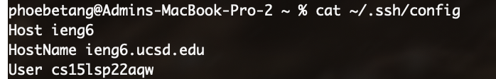
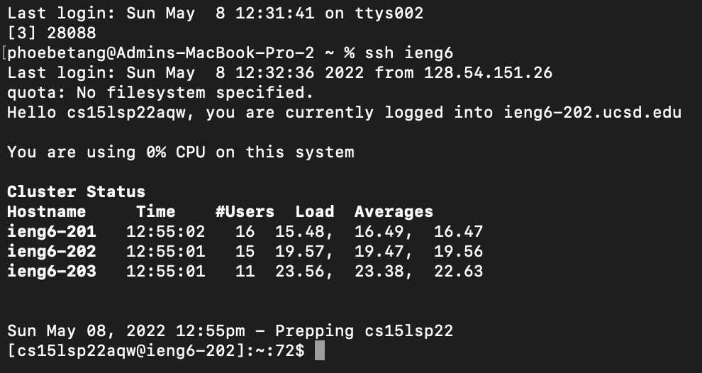
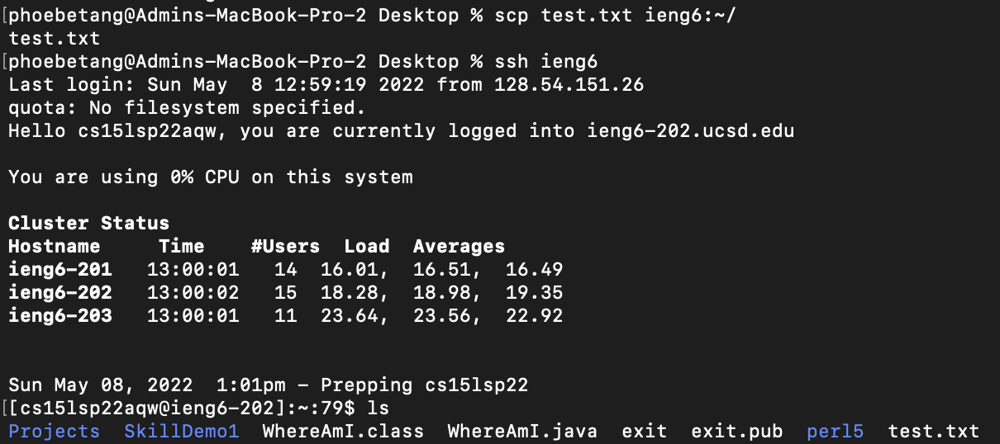
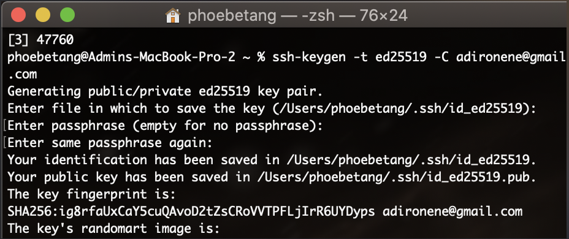

# Lab Report 3

[Home](https://adironene.github.io/CSE15l/index.html) 

In this lab report, I will discuss a few skills introduced to facilitate working with SSH and Github Repos. 
- **SSH Configuration** - Set up a shortcut to refrain from typing out the entire server name. If set up correctly, I only need to type `ssh ieng6` instead of `ssh cs15lsp22[user name]@ieng6.ucsd.edu`.
- **Github Access** - Set up a SSH Key to Github. When the key is set up correctly, you should be able to `clone` from private repository and `push`.
- **Copying Directories**

<br/><br/>

## SSH Configuration

It is tedious to type out `ssh cs15lsp22[user name]@ieng6.ucsd.edu` each time I try to log on to a server. To address this problem, we can edit the SSH Config file to add a nickname for the server. This way, SSH knows which server to log on to when you type the nickname.


To set up, take the following steps:
- Create or edit the `~/.ssh/config` file
- add the following lines in the file

```
Host ieng6
HostName ieng6.ucsd.edu
User cs15lsp22zzz (use your username)
```

- You may use the command `cat > ~/.ssh/config ` and paste in the lines above

When you are finished with the steps above, your config file should look like this:




After the config file has been set up, you should be able to type `ssh ieng6` and log in successfully



Now I will try to `scp` a file to the server with the nickname shortcut. I will execute the following command.
```
touch test.txt
scp test.txt ieng6:~/
```
- I created the file `test.txt`
- I copied the file to the ieng6 server
- After this, I should be able to see the file on the server when I SSH in.



----

<br/><br/>

## Github Access

Github no longer supports password login for pushing through terminal. In order to performs such actions, you must set up token-based login. This skill allows us to set up SSH keys to our github accounts.

#### Generate a new SSH Key
- Open up terminal and type the following line

```
ssh-keygen -t ed25519 -C "[your email]@[email].com"
```
- Press `enter` twice to skip passphrase
- After this process, you should have your key set up



- Type the following line in terminal to copy the contents of the key file

```
pbcopy < ~/.ssh/id_ed25519.pub
```
- Go to Github > Profile Icon > Settings > SSH and GPG Keys
- Click on `New SSH Key`
- Enter a description for your key and paste in the copied text on clipboard
- Click on `Add SSH Key` and finish up

