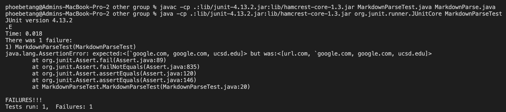

# Lab Report 1

[Home](https://adironene.github.io/CSE15l/index.html) 

Debugging might take more time than the intial coding process. It is important to offer clean and organized code in order to quickly find the error and fix it. Moreover, practicing clean coding habits allow other developers to understand and work with your code.
 <br/><br/>

## Intro

We will be running 3 tests on both [my solution](https://github.com/adironene/markdown-parser) and [other group solution](https://github.com/Combobyte/markdown-parser) to MarkdownParser For each test, I will include
- The test file
- The correct output
- The test implementation
- The outputs of the test
- An explanation of the code

<br/><br/>

## Test Case 1

#### The test file
```
`[a link`](url.com)

[another link](`google.com)`

[`cod[e`](google.com)

[`code]`](ucsd.edu)

```

#### The correct output

The first line would be embeded so the 2nd, 3rd, and 4th link should count.

``` 
["`google.com", "google.com", "ucsd.edu"]
```


#### The test implementation

> For my test file, this is how I added the tester method.

```java
import java.io.IOException;
import java.nio.file.Files;
import java.nio.file.Path;
import java.util.ArrayList;
import java.util.Arrays;

import static org.junit.Assert.*;
import org.junit.*;

public class MarkdownParseTest {

    @Test
    public void testFile() throws IOException {
        Path fileName = Path.of("lab4-snippet1.md");
        String content = Files.readString(fileName);
        MarkdownParse m = new MarkdownParse();
        ArrayList<String> links = m.getLinks(content);
        ArrayList<String> correct_links = new ArrayList<>(Arrays.asList("`google.com", "google.com", "ucsd.edu"));
        assertEquals(correct_links, links);
    }
}
```

The lab4-snippet1.md file had the snippet copied over.

> For the other group's file, this is how I added the tester method.

```java
import static org.junit.Assert.*;
import org.junit.*;
import java.util.*;
import java.io.*;
import java.nio.file.Files;
import java.nio.file.Path;


public class MarkdownParseTest {

    @Test
    public void MarkdownParseTest() throws IOException{
        ArrayList<String> expected = new ArrayList<>(List.of("`google.com", "google.com", "ucsd.edu"));
        ArrayList<String> resultArray = MarkdownParse.getLinks(Files.readString(Path.of("lab4-snippet1.md")));
        assertEquals(expected, resultArray);
    }
}
```

The lab4-snippet1.md file had the snippet copied over.

#### The outputs of the test

My code did not pass the JUnit Test


The other group's code did not pass the JUnit Test



#### An explanation of the code

> Do you think there is a small (<10 lines) code change that will make your program work for snippet 1 and all related cases that use inline code with backticks? If yes, describe the code change. If not, describe why it would be a more involved change.


A: Yes, a small code change would make my program work for snippet 1. I believe that both teams were unaware of the backstick being a problem. In order to fix the issue, we would have an if() statement to check if there is a "(" ")" "[" or "]" in between multiple backsticks, and there isn't another one of the character; if so, delete the link from the list.

<br/><br/>

## Test Case 2

#### The test file
```
[a [nested link](a.com)](b.com)

[a nested parenthesized url](a.com(()))

[some escaped \[ brackets \]](example.com)

```

#### The correct output


``` []```

#### The test implementation

> For my test file, this is how I added the tester method.

```java

```

<!-- The lab4-snippet1.md file had the snippet copied over. -->

> For the other group's file, this is how I added the tester method.

```java

```

<!-- The lab4-snippet1.md file had the snippet copied over. -->

#### The outputs of the test

<!-- My code did not pass the JUnit Test -->

<!--  -->

<!-- The other group's code did not pass the JUnit Test -->

<!--  -->

#### An explanation of the code

> Do you think there is a small (<10 lines) code change that will make your program work for snippet 2 and all related cases that nest parentheses, brackets, and escaped brackets? If yes, describe the code change. If not, describe why it would be a more involved change.


A: 

## Test Case 3

#### The test file
```
[this title text is really long and takes up more than 
one line

and has some line breaks](
    https://www.twitter.com
)

[this title text is really long and takes up more than 
one line](
https://sites.google.com/eng.ucsd.edu/cse-15l-spring-2022/schedule
)


[this link doesn't have a closing parenthesis](github.com

And there's still some more text after that.

[this link doesn't have a closing parenthesis for a while](https://cse.ucsd.edu/


)

And then there's more text

```

#### The correct output


``` []```

#### The test implementation

> For my test file, this is how I added the tester method.

```java

```

<!-- The lab4-snippet1.md file had the snippet copied over. -->

> For the other group's file, this is how I added the tester method.

```java

```

<!-- The lab4-snippet1.md file had the snippet copied over. -->

#### The outputs of the test

<!-- My code did not pass the JUnit Test -->

<!--  -->

<!-- The other group's code did not pass the JUnit Test -->

<!--  -->

#### An explanation of the code

> Do you think there is a small (<10 lines) code change that will make your program work for snippet 3 and all related cases that have newlines in brackets and parentheses? If yes, describe the code change. If not, describe why it would be a more involved change.


A: 