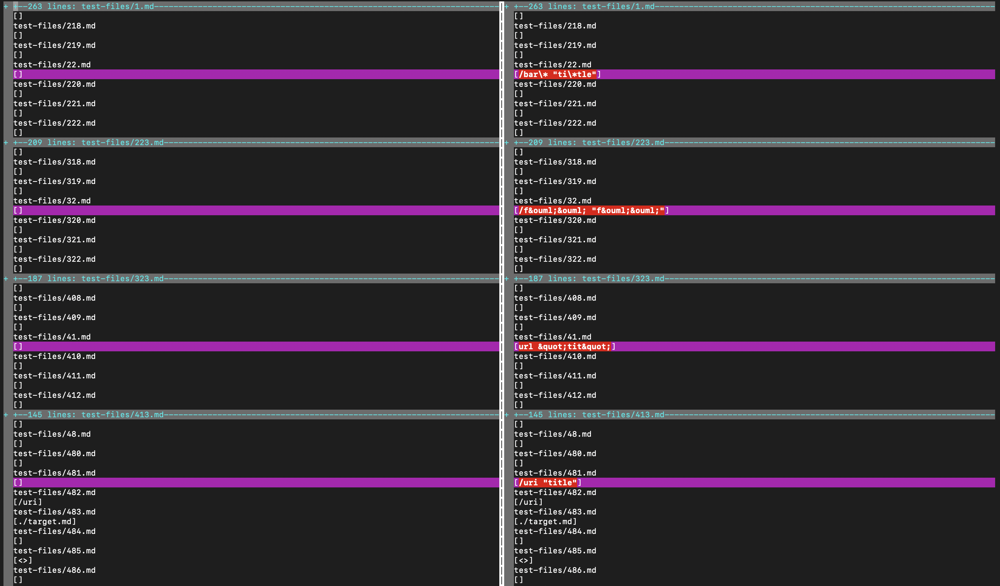
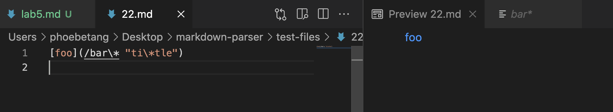
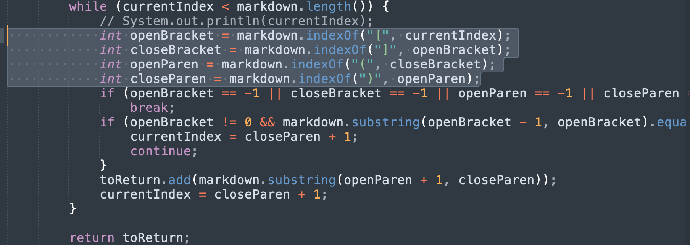
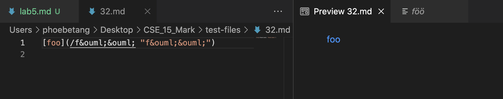
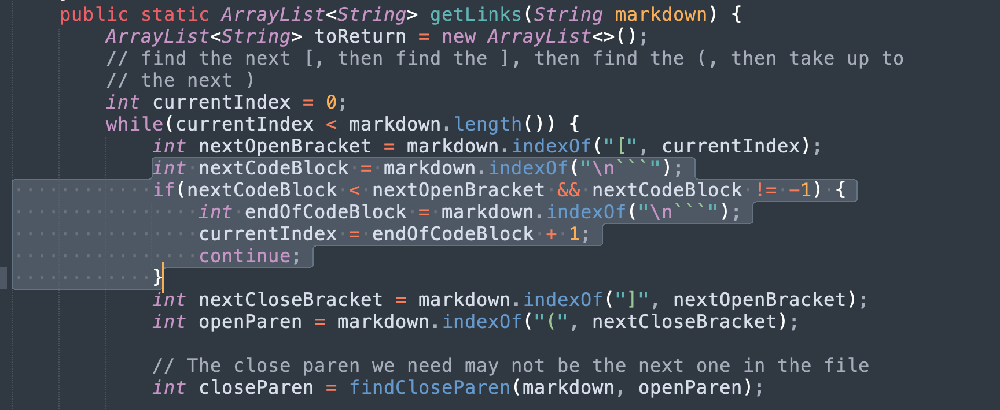

# Lab Report 5

[Home](https://adironene.github.io/CSE15l/index.html) 

For this lab, we will work with analyzing the performance of two different implementations of `Markdown Parser`. The two solutions include [mine](https://github.com/adironene/markdown-parser) and [CSE 15L provided](https://github.com/nidhidhamnani/markdown-parser).
 <br/><br/>

## Intro

We will be analyzing 2 tests where [my solution](https://github.com/adironene/markdown-parser) and [CSE 15L provided solution](https://github.com/nidhidhamnani/markdown-parser) had different results. For each test, I will include
- How I found the test with different results
- Link to the test file in question
- Describe which solution is correct, if any
- Indicate both outputs and the correct output
- Describe the bug of the incorrect implementation

<br/><br/>

## Test Case 1 (file 22)

#### How I found the test
> How you found the tests with different results (Did you use vimdiff on the results of running a bash for loop? Did you search through manually? Did you use some other programmatic idea?)

A : I used vimdiff on the results of running a bash for loop

```
vimdiff CSE_15_Mark/results.txt markdown-parser/results.txt
```



#### Link to the test file in question

> Provide a link to the test-file with different-results (in the provided repository or
your repository , either is fine)

The link to the test file can be found [here](https://github.com/nidhidhamnani/markdown-parser/blob/main/test-files/22.md).

#### Describe which solution is correct, if any

> Describe which implementation is correct, or neither if both give the
wrong output

I believe that both implementations are incorrect. The one provided did not parse any links, and the one I had parsed an incorrect link

#### Indicate both outputs and the correct output
> Indicate both actual outputs (provide screenshots) and also what the
expected output is (list the links that are expected in the output).

`my output`


`provided output`


`expected output`

```
["bar*"]
```


#### Describe the bug of the incorrect implementation
> For the implementation that’s not correct (or choose one if both are
incorrect), describe the bug (the problem in the code) in about 2-3
sentences. You don’t have to provide a fix, but you should be specific
about what is wrong with the program, and show the code that should
be fixed (Provide a screenshot of code and highlight where the change
needs to be made).



Since both solutions are wrong, I decided to take a look at my code file. The bug is that my code is not recognizing backslashes, which are used to escape the character after. I would need to add an `if` condition after the highlighted lines to see if a backslash is used, and if so, ignore the functionality of the following character.

<br/><br/>

## Test Case 2 (file 32)

#### How I found the test
> How you found the tests with different results (Did you use vimdiff on the results of running a bash for loop? Did you search through manually? Did you use some other programmatic idea?)

A : I used vimdiff on the results of running a bash for loop

```
vimdiff CSE_15_Mark/results.txt markdown-parser/results.txt
```


#### Link to the test file in question

> Provide a link to the test-file with different-results (in the provided repository or
your repository , either is fine)

The link to the test file can be found [here](https://github.com/nidhidhamnani/markdown-parser/blob/main/test-files/32.md).

#### Describe which solution is correct, if any

> Describe which implementation is correct, or neither if both give the
wrong output

I believe that both implementations are incorrect. The one provided did not parse any links, and the one I had parsed the raw string instead of the link with accented characters.

#### Indicate both outputs and the correct output
> Indicate both actual outputs (provide screenshots) and also what the
expected output is (list the links that are expected in the output).

`my output`


`provided output`


`expected output`

```
["föö"]
```


#### Describe the bug of the incorrect implementation
> For the implementation that’s not correct (or choose one if both are
incorrect), describe the bug (the problem in the code) in about 2-3
sentences. You don’t have to provide a fix, but you should be specific
about what is wrong with the program, and show the code that should
be fixed (Provide a screenshot of code and highlight where the change
needs to be made).



Both solutions are wrong again so I chose to look at the provided solution instead. The bug is that the code is not recognizing characters that might form an accented character. To fix this, I think we need to have an accented character dictionary and check if there are any between the brackets (highlighted code). If so, then use the accented character instead of the raw parse.

<br/><br/>
